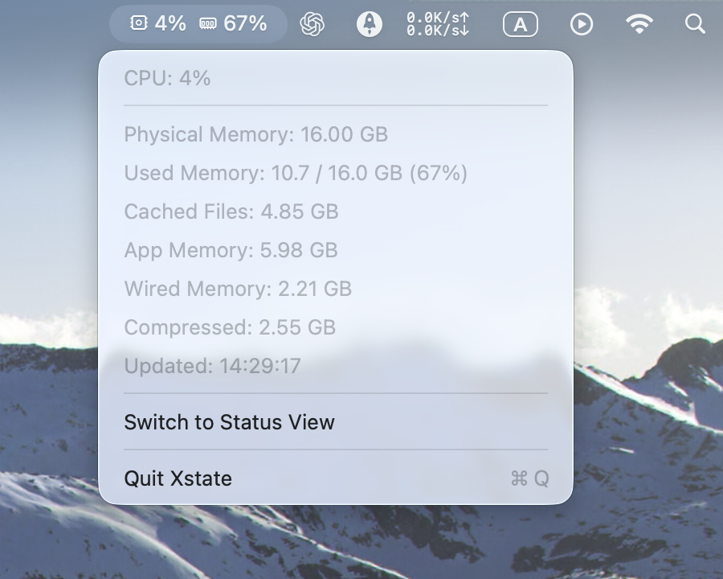
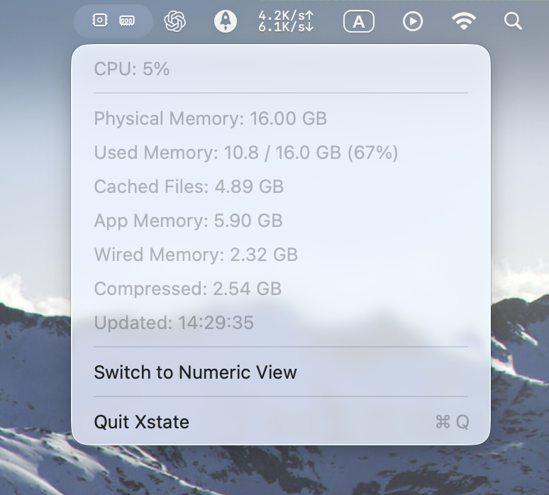

# Xstate

Xstate 是一个原生 macOS 状态栏小应用（无窗口），用于实时展示 CPU 与内存压力。  
支持两种显示模式：

- 状态模式：白/黄/红图标
- 数值模式：百分比

内存口径为 `Used = App + Wired + Compressed`，`Cached Files` 单独展示，不计入告警百分比。

## 特性

- 仅状态栏展示，支持状态模式与数值模式切换
- 1 秒刷新频率
- Darwin/Mach API 直接采样，无三方依赖
- 点击状态栏可查看 CPU/内存详情并退出
- 菜单支持 `Switch to Numeric View / Switch to Status View`
- 内存明细包括：Physical、Used、Cached Files、App、Wired、Compressed

## 界面截图

### 数值模式（显示百分比）

菜单项显示 `Switch to Status View`，表示当前处于数值模式，状态栏展示 CPU/MEM 百分比。



### 状态模式（白/黄/红图标）

菜单项显示 `Switch to Numeric View`，表示当前处于状态模式，状态栏使用图标颜色表达负载等级。



## 环境要求

- macOS 13+
- Swift 6.2+（或兼容版本）
- Xcode Command Line Tools（`swift`、`sips`、`iconutil` 可用）

## 本地开发

运行应用：

```bash
swift run Xstate
```

执行测试：

```bash
swift test
```

构建（调试）：

```bash
swift build
```

## 生成 `.app`

```bash
./install.sh --force
```

默认输出为 `dist/Xstate.app`，并自动生成 `Contents/Resources/AppIcon.icns`。

常用参数：

- `--install`：同时安装到 `/Applications`
- `--name <AppName>`：自定义 App 名称
- `--bundle-id <bundle.id>`：自定义 Bundle ID
- `--output-dir <path>`：自定义输出目录
- `--force`：覆盖已有同名 `.app`

## 告警阈值配置

在 `Sources/SystemPulseApp/AppDelegate.swift` 中调整：

```swift
private let thresholds = AlertThresholds(
    cpuWarningUsage: 0.90,
    cpuCriticalUsage: 0.99,
    memoryWarningUsage: 0.90,
    memoryCriticalUsage: 0.99
)
```

- `Warning`：黄色预警
- `Critical`：红色告警
- 低于 `Warning`：白色

## 目录结构

- `Sources/MonitorCore/SystemSampler.swift`：Mach API 采样
- `Sources/MonitorCore/StatusEvaluator.swift`：阈值判定
- `Sources/MonitorCore/ValueFormatters.swift`：状态栏文案格式化
- `Sources/SystemPulseApp/MenuBarController.swift`：状态栏 UI 与刷新调度
- `Sources/SystemPulseApp/AppIconProvider.swift`：应用图标生成/注入
- `Tests/`：单元测试
- `scripts/`：辅助脚本

## Git 提交约定（已更新）

以下目录/文件已加入 `.gitignore`，默认不提交：

- `/.build/`
- `/dist/`（本地打包产物）
- `/.swiftpm/`
- `DerivedData/`、`xcuserdata/`
- `.DS_Store`、`.idea/`、`.vscode/`

## 推送到 GitHub

如果尚未设置远程：

```bash
git remote add origin git@github.com:gmaxxxie/Xstate.git
```

提交并推送：

```bash
git add .
git commit -m "chore: update gitignore and README"
git push -u origin main
```
